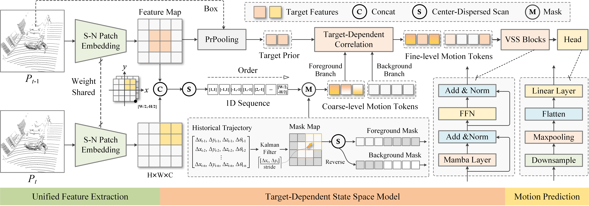
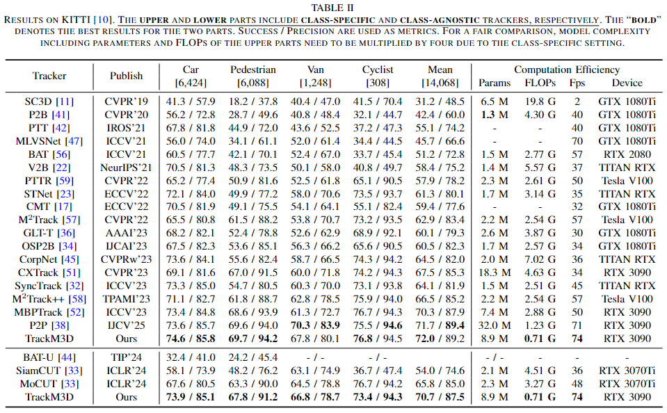
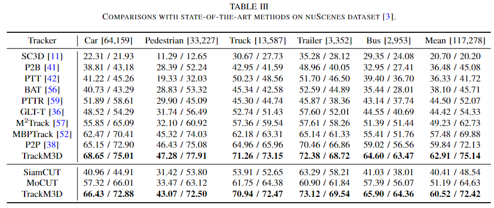
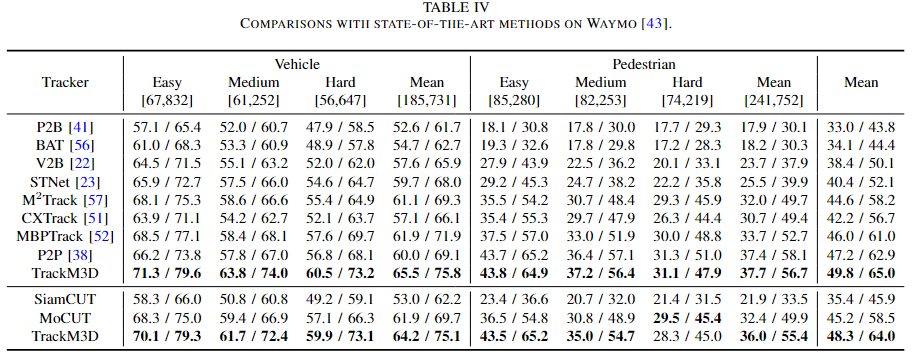

# TrackM3D 

The official implementation of the paper:

**TrackM3D: Target-Dependent State Space Model Enables a Strong Class-Agnostic Tracker for LiDAR Point Clouds**
>  [Jiahao Nie](https://scholar.google.com/citations?user=R0uN6pcAAAAJ&hl=zh-CN), [Fei Xie](https://scholar.google.com/citations?user=GbGmwiwAAAAJ&hl=zh-CN&oi=ao), [Sifan Zhou](https://scholar.google.com/citations?user=kSdqoi0AAAAJ&hl=zh-CN&oi=ao), [Mengmeng Wang](https://scholar.google.com/citations?user=VSRnUiUAAAAJ&hl=zh-CN&oi=ao), [Wankou Yang](https://scholar.google.com/citations?user=PMzEsJgAAAAJ&hl=zh-CN&oi=ao), [Kaihua Zhang](https://scholar.google.com/citations?user=FYatMi8AAAAJ&hl=zh-CN&oi=ao), [Zhenhua Feng](https://scholar.google.com/citations?user=Y6KtijIAAAAJ&hl=zh-CN&oi=ao).

<div id="top" align="center">
<p align="center">

</p>
</div>

## 📜 Introduction

<p align="justify">LiDAR point cloud-based 3D single object tracking typically trains one model for each object class, incurring redundant parameters. 
While recent CUTrack presents class-agnostic models that track objects across all classes using a single network, it has limited cross-class generalization incurred by class-sensitive task layers. 
This paper introduces a novel class-agnostic tracking method, called TrackM3D. It performs unified tracking by directly modeling inter-frame motion cues of targets via a newly proposed target-dependent state space model (SSM), getting rid of class-sensitive task layers.
The target-dependent SSM possesses two core designs: 1) it incorporates voxel state space (VSS) blocks to explore motion cues, exhibiting better generalization to model motion patterns of 3D objects than convolution- and transformer-based models; 2) it designs a target-dependent selective scan module to provide target motion-aware causal sequence, facilitating motion modeling for VSS, as well as interfering object discrimination. 
In addition, before target-dependent SSM, a structure-normalized patch embedding is devised to simultaneously encode diverse object classes, which have dynamically changing point cloud data distributions and geometric structures.
Experimental results demonstrate that TrackM3D not only outperforms previous class-agnostic counterpart (4.9%, 9.3% and 5.5% performance gains on KITTI, nuScenes and Waymo, respectively) with higher computation efficiency, but also bridges performance gaps between class-specific and class-agnostic tracking schemes. 

## 🔥 Highlights

**TrackM3D** is a strong class-agnostic tracker for 3D SOT on LiDAR point clouds that have:

- *SOTA performance on KITTI, NuScenes and Waymo*.
- *High efficiency*.

<div id="top" align="center">
<p align="center">

</p>
</div>

<div id="top" align="center">
<p align="center">

</p>
</div>

<div id="top" align="center">
<p align="center">

</p>
</div>

## 🕹️ Setup

Here, we list the most important part of our dependencies

|Dependency|Version|
|---|---|
|python|3.9.0|
|pytorch|2.0.1|
|mmegine|0.7.4|
|mmcv|2.0.0|
|mmdet|3.0.0|
|mmdet3d|1.1.0|
|spconv|2.3.6|
|causal-conv1d|1.1.1|
|mamba-ssm|1.1.1|

>Note: In addition to above installer, you will need to unzip the `environment_codes.zip` and replace the `voxelize.py` file under the `mmdet3d/models/data_preprocessors` package with the unzipped `.py` file.

## 📋 Dataset Preparation

### KITTI

+ Download the data for [velodyne](http://www.cvlibs.net/download.php?file=data_tracking_velodyne.zip), [calib](http://www.cvlibs.net/download.php?file=data_tracking_calib.zip) and [label_02](http://www.cvlibs.net/download.php?file=data_tracking_label_2.zip) from [KITTI Tracking](http://www.cvlibs.net/datasets/kitti/eval_tracking.php).
+ Unzip the downloaded files.
+ Put the unzipped files under the same folder as following.
  ```
  [Parent Folder]
  --> [calib]
      --> {0000-0020}.txt
  --> [label_02]
      --> {0000-0020}.txt
  --> [velodyne]
      --> [0000-0020] folders with velodynes .bin files
  ```

### NuScenes

+ Download the dataset from the [download page](https://www.nuscenes.org/download)
+ Extract the downloaded files and make sure you have the following structure:
  ```
  [Parent Folder]
    samples	-	Sensor data for keyframes.
    sweeps	-	Sensor data for intermediate frames.
    maps	        -	Folder for all map files: rasterized .png images and vectorized .json files.
    v1.0-*	-	JSON tables that include all the meta data and annotations. Each split (trainval, test, mini) is provided in a separate folder.
  ```
>Note: We use the **train_track** split to train our model and test it with the **val** split. Both splits are officially provided by NuScenes. During testing, we ignore the sequences where there is no point in the first given bbox.


### Waymo Open Dataset

+ We follow the benchmark created by [LiDAR-SOT](https://github.com/TuSimple/LiDAR_SOT) based on the waymo open dataset. You can download and process the waymo dataset as guided by [LiDAR_SOT](https://github.com/TuSimple/LiDAR_SOT), and use our code to test model performance on this benchmark.
+ The following processing results are necessary
   ```
    [waymo_sot]
        [benchmark]
            [validation]
                [vehicle]
                    bench_list.json
                    easy.json
                    medium.json
                    hard.json
                [pedestrian]
                    bench_list.json
                    easy.json
                    medium.json
                    hard.json
        [pc]
            [raw_pc]
                Here are some segment.npz files containing raw point cloud data
        [gt_info]
            Here are some segment.npz files containing tracklet and bbox data 
    ```

## 🤗 Training

+ To train a model, you must specify the `.py` file. The `.py` file contains all the configurations of the dataset and the model. We provide `.py` files under the [configs](./configs) directory. 

>Note: Before running the code, you will need to edit the `.py` file by setting the `path` argument as the correct root of the dataset.

    ```
    # single-gpu training
    python train.py --config configs/trackm3d/kitti/all.py
    # multi-gpu training
    # you will need to edit the `train.py` file by setting the `config` argument
    ./dist_train.sh
    ```

## 🤗 Testing

+ To test a trained model, specify the checkpoint location with `--resume_from` argument and set the `--phase` argument as `test`.

>Note: Before running the code, you will need to edit the `.py` file by setting the `path` argument as the correct root of the dataset.

    ```
    # single-gpu testing
    python test.py --config configs/trackma3d/kitti/all.py --load_from pretrained//kitti.pth
    # multi-gpu testing
    # you will need to edit the `test.py` file by setting the `config` and 'load_from' argument
    ./dist_test.sh
    ```
## ❤️ Acknowledgement
This repo is built upon [Open3DSOT](https://github.com/Ghostish/Open3DSOT), [MMDetection3D](https://github.com/open-mmlab/mmdetection3d) and [PointMamba](https://github.com/LMD0311/PointMamba/). We acknowledge these excellent implementations.
